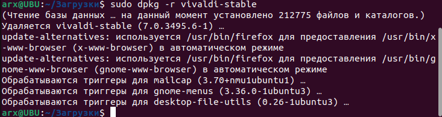
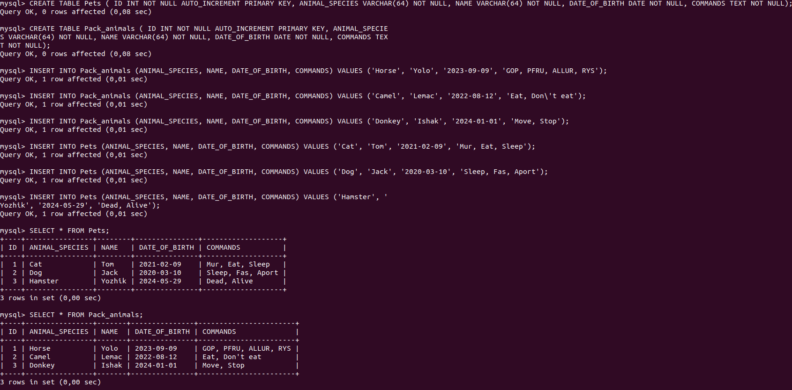
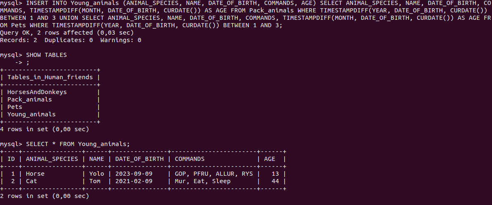

1. Использование команды cat в Linux
    - Создать два текстовых файла: "Pets"(Домашние животные) и "Pack animals"(вьючные животные), используя команду `cat`
      в терминале Linux. В первом файле перечислить собак, кошек и хомяков. Во втором — лошадей, верблюдов и ослов.
    - Объединить содержимое этих двух файлов в один и просмотреть его содержимое.
    - Переименовать получившийся файл в "Human Friends"(.  
      Результат выполнения: 

2. Работа с директориями в Linux
    - Создать новую директорию и переместить туда файл "Human Friends".  
      Результат выполнения: 

3. Работа с MySQL в Linux. “Установить MySQL на вашу вычислительную машину ”
    - Подключить дополнительный репозиторий MySQL и установить один из пакетов из этого репозитория.
      Результат выполнения: 

4. Управление deb-пакетами
    - Установить и затем удалить deb-пакет, используя команду `dpkg`.
      Результат выполнения:
        
        
      

5. История команд в терминале Ubuntu
    - Сохранить и выложить историю ваших терминальных команд в Ubuntu.
      В формате: Файла с ФИО, датой сдачи, номером группы(или потока)
      Результат выполнения в файле:  "Бизюков М.А. терминальные команды.txt"

Объектно-ориентированное программирование

6. Диаграмма классов
    - Создать диаграмму классов с родительским классом "Животные", и двумя подклассами: "Pets" и "Pack animals".
      В составы классов которых в случае Pets войдут классы: собаки, кошки, хомяки, а в класс Pack animals войдут:
      Лошади, верблюды и ослы).
      Каждый тип животных будет характеризоваться (например, имена, даты рождения, выполняемые команды и т.д)
      Диаграмму можно нарисовать в любом редакторе, такими как Lucidchart, Draw.io, Microsoft Visio и других.

7. Работа с MySQL (Задача выполняется в случае успешного выполнения задачи “Работа с MySQL в Linux. “Установить MySQL на
   вашу машину”

7.1. После создания диаграммы классов в 6 пункте, в 7 пункте база данных "Human Friends" должна быть структурирована в
соответствии с этой диаграммой.
Например, можно создать таблицы, которые будут соответствовать классам "Pets" и "Pack animals", и в этих таблицах будут
поля, которые характеризуют
каждый тип животных (например, имена, даты рождения, выполняемые команды и т.д.).
7.2 - В ранее подключенном MySQL создать базу данных с названием "Human Friends".

- Создать таблицы, соответствующие иерархии из вашей диаграммы классов.
- Заполнить таблицы данными о животных, их командах и датами рождения.
- Удалить записи о верблюдах и объединить таблицы лошадей и ослов.
- Создать новую таблицу для животных в возрасте от 1 до 3 лет и вычислить их возраст с точностью до месяца.
- Объединить все созданные таблицы в одну, сохраняя информацию о принадлежности к исходным таблицам.
  Результат выполнения:  
  Вход в mysql:
    
  Создание базы данных:
    
  Создание таблиц "Pets" и "Pack_animals" и заполнение их данными:  
    
  Удаление записей о верблюде и создание новой таблицы с записями о лошадях и ослах:
    
    
  Создание новой таблицы для молодых животных:  
    
  Объединение всех таблиц в одну:  
  

8. ООП и Java
    - Создать иерархию классов в Java, который будет повторять диаграмму классов созданную в задаче 6(Диаграмма
      классов).
      Результат
      выполнения: 
9. Программа-реестр домашних животных
    - Написать программу на Java, которая будет имитировать реестр домашних животных.
      Должен быть реализован следующий функционал:

9.1. Добавление нового животного

- Реализовать функциональность для добавления новых животных в реестр.       
  Животное должно определяться в правильный класс (например, "собака", "кошка", "хомяк" и т.д.)

9.2. Список команд животного

- Вывести список команд, которые может выполнять добавленное животное (например, "сидеть", "лежать").

9.3. Обучение новым командам

- Добавить возможность обучать животных новым командам.

9.4 Вывести список животных по дате рождения

9.5. Навигация по меню

- Реализовать консольный пользовательский интерфейс с меню для навигации между вышеуказанными функциями.

10. Счетчик животных

- Создать механизм, который позволяет вывести на экран общее количество созданных животных любого типа
  (Как домашних, так и вьючных), то есть при создании каждого нового животного счетчик увеличивается на “1”.

